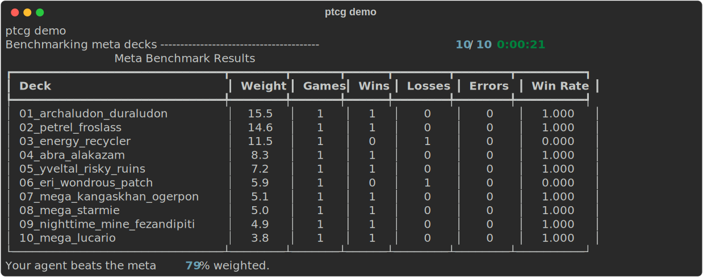

# ptcg-meta-bench

[](https://github.com/goldbar123467/ptcg-meta-bench/actions/workflows/ci.yml)
[](LICENSE)

Friendly local benchmark tools for Pokemon TCG AI Battle agents. The `ptcg`
command runs the official Kaggle engine locally, benchmarks an agent against a
weighted 10-deck meta panel, and exposes the same workflow to AI agents through
JSON and MCP.

## Get started in 60 seconds

First download `pokemon-tcg-ai-battle.zip` from Kaggle and leave it in your
Downloads folder. Then paste one block.

Linux:

```bash
PTCG_SDK_ZIP="$HOME/Downloads/pokemon-tcg-ai-battle.zip" bash -c "$(curl -fsSL https://raw.githubusercontent.com/goldbar123467/ptcg-meta-bench/v1.1.0/install.sh)"
```

Windows PowerShell:

```powershell
$env:PTCG_SDK_ZIP="$env:USERPROFILE\Downloads\pokemon-tcg-ai-battle.zip"; irm https://raw.githubusercontent.com/goldbar123467/ptcg-meta-bench/v1.1.0/install.ps1 | iex
```

The installer checks Python and git, creates an isolated virtual environment,
installs `ptcg`, imports the Kaggle SDK zip, runs `ptcg doctor`, then runs
`ptcg demo`.

## What You Will See

This is real `ptcg demo` output from this repo:



```text
Benchmarking meta decks ---------------------------------------- 10/10 0:00:21
                             Meta Benchmark Results
+---------------------------+--------+-------+------+--------+--------+----------+
| Deck                      | Weight | Games | Wins | Losses | Errors | Win Rate |
+---------------------------+--------+-------+------+--------+--------+----------+
| 01_archaludon_duraludon   |   15.5 |     1 |    1 |      0 |      0 |    1.000 |
| 02_petrel_froslass        |   14.6 |     1 |    1 |      0 |      0 |    1.000 |
| 03_energy_recycler        |   11.5 |     1 |    0 |      1 |      0 |    0.000 |
| 04_abra_alakazam          |    8.3 |     1 |    1 |      0 |      0 |    1.000 |
| 05_yveltal_risky_ruins    |    7.2 |     1 |    1 |      0 |      0 |    1.000 |
| 06_eri_wondrous_patch     |    5.9 |     1 |    0 |      1 |      0 |    0.000 |
| 07_mega_kangaskhan_ogerpon|    5.1 |     1 |    1 |      0 |      0 |    1.000 |
| 08_mega_starmie           |    5.0 |     1 |    1 |      0 |      0 |    1.000 |
| 09_nighttime_mine_fezandip|    4.9 |     1 |    1 |      0 |      0 |    1.000 |
| 10_mega_lucario           |    3.8 |     1 |    1 |      0 |      0 |    1.000 |
+---------------------------+--------+-------+------+--------+--------+----------+
Your agent beats the meta 79% weighted.
```

There is no coding needed to try the benchmark. Put the Kaggle zip in place,
install, and use the commands below.

## Commands

```bash
ptcg demo
ptcg bench --games 20 --agent examples/agents/simple_baseline
ptcg decks
ptcg play --deck 01_archaludon_duraludon
ptcg doctor
```

Every command supports `--json` for terminal agents:

```bash
ptcg demo --games 2 --json
ptcg decks --json
ptcg doctor --json
```

The older command names still work:

```bash
ptcg quickstart --sdk-zip data/competition/pokemon-tcg-ai-battle.zip
ptcg-meta-bench quickstart --sdk-zip data/competition/pokemon-tcg-ai-battle.zip
python -m ptcg_meta_bench list-decks
```

If you do not want to run the one-paste installer, clone the repo, create a
virtual environment, install with `python -m pip install -e .`, put the Kaggle
zip at `data/competition/pokemon-tcg-ai-battle.zip`, then run `ptcg doctor`.

## Troubleshooting

`ptcg doctor` says the SDK is missing:

Put `pokemon-tcg-ai-battle.zip` at `data/competition/pokemon-tcg-ai-battle.zip`
inside the installed source checkout, or rerun the installer with
`PTCG_SDK_ZIP` pointing at the zip.

`python3` is missing on Linux:

Install Python 3.10 or newer with your system package manager, then rerun the
Linux one-paste command.

`git` is missing:

Install git, then rerun the one-paste command. The installer uses git so it can
update the existing isolated checkout idempotently.

`ptcg bench --games 0 --json` returns:

```json
{
  "message": "--games must be at least 1",
  "status": "error"
}
```

That is a normal friendly user error, not a traceback.

## Agent And MCP Use

Use CLI plus `--json` for terminal agents such as Codex:

```bash
ptcg decks --json
ptcg demo --games 2 --json
ptcg bench --games 20 --agent examples/agents/simple_baseline --json
```

Use MCP for MCP clients such as Claude Desktop:

```json
{
  "mcpServers": {
    "ptcg-meta-bench": {
      "command": "ptcg",
      "args": ["mcp"]
    }
  }
}
```

The MCP server exposes `list_decks`, `run_benchmark`, `play_game`, and
`get_last_results`.

## Technical Notes

The repo does not vendor the Kaggle SDK zip, native engine libraries, card
images, or private submissions. You provide your own Kaggle competition zip.
The included `examples/agents/simple_baseline` agent is intentionally minimal;
it is a runnable contract example, not a tuned leaderboard agent.

The local agent layout is:

```text
my_agent/
  main.py
  deck.csv
  metadata.json
```

`deck.csv` must contain exactly 60 integer card IDs. The local runner validates
candidate imports, initial deck returns, selection bounds, engine errors, and
max-decision stalls.

This is an unofficial fan project for the Kaggle Pokemon TCG AI Battle
competition. It is not affiliated with, endorsed by, sponsored by, or approved
by Pokemon, Nintendo, Creatures, Game Freak, or Kaggle. No card images are
included.
